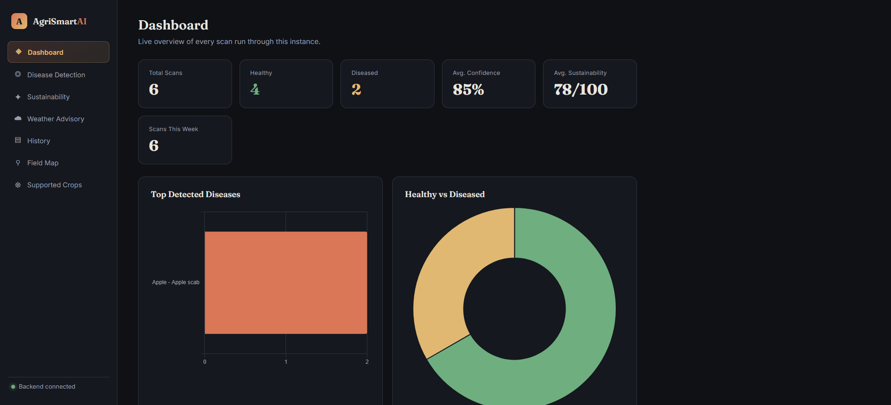
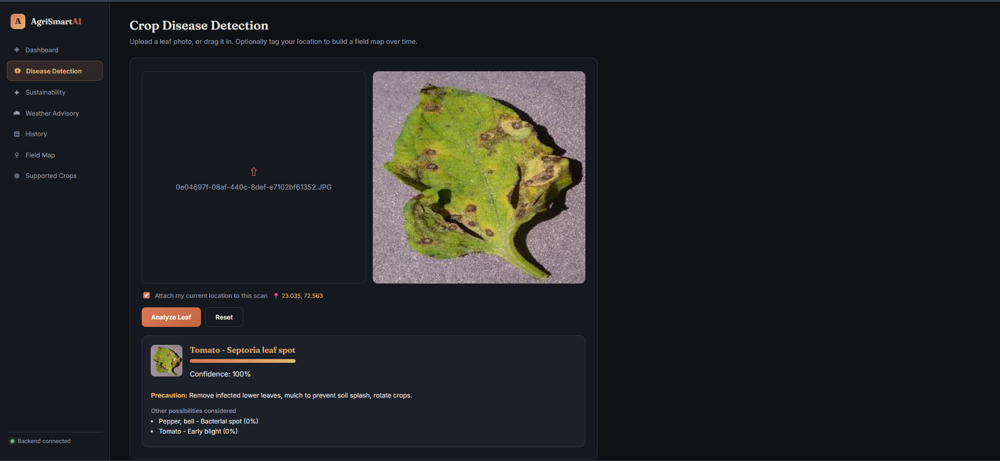
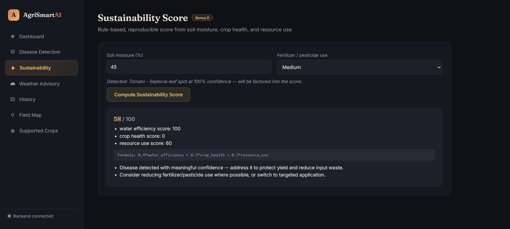
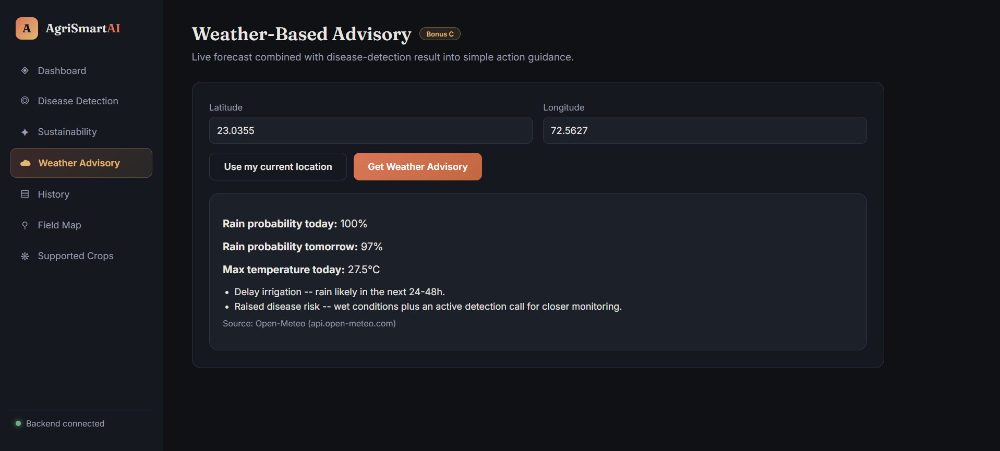
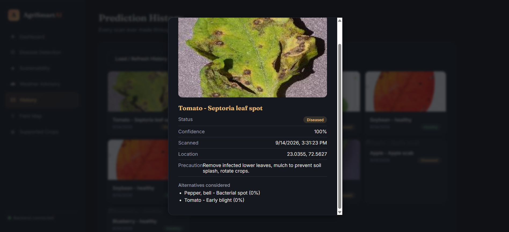
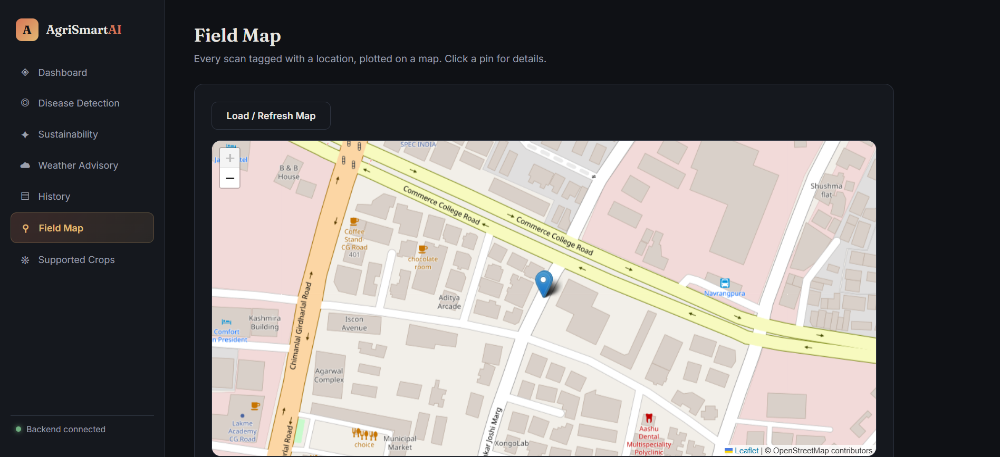

# AgriSmart AI - Crop Disease Detection & Advisory Platform

**SIH 2026 Internal Hackathon** | L. J. Institute of Engineering and Technology [C-433]
**Problem Statement 1**: AgriSmart AI - Intelligent Agriculture for a Sustainable Future

---

## Table of Contents
1. [Modules Built](#1-modules-built)
2. [Screenshots](#2-screenshots)
3. [Setup & Run Instructions](#3-setup--run-instructions)
4. [Dataset Used](#4-dataset-used)
5. [Reported Metrics](#5-reported-metrics)
6. [Architecture Overview](#6-architecture-overview)
7. [Known Limitations](#7-known-limitations)
8. [Demo Video & Deployed App](#8-demo-video--deployed-app)
9. [Originality Declaration](#9-originality-declaration)

---

## 1. Modules Built

**Core task (mandatory):**
- AI-powered crop-disease detection from leaf images (computer vision), with
  macro-F1 + confusion matrix reporting on a held-out field test set, and a
  farmer-facing result with precautionary guidance.

**Bonus modules:**
- **Bonus C - Weather-Based Intelligence**: live forecast (Open-Meteo) combined
  with the disease-detection result into simple, actionable guidance (e.g.
  "delay irrigation - rain likely", "raised disease risk - monitor").
- **Bonus D - Sustainability Score**: rule-based, fully reproducible score
  (published formula below) from water efficiency, crop health, and
  resource-use inputs, with improvement suggestions.

---

## 2. Screenshots

> **Where to put your images:** create a folder named `docs/screenshots/` in
> the root of the repo (same level as `frontend/`, `backend/`, `model/`).
> Save each screenshot there using the filenames referenced below, then the
> images will render automatically on GitHub / GitLab when this README is
> viewed. PNG or JPG both work; keep each file under ~1-2 MB so the README
> loads fast.
>
> ```
> agrismart-ai/
> ├── backend/
> ├── frontend/
> ├── model/
> ├── report/
> ├── docs/
> │   └── screenshots/
> │       ├── dashboard.png
> │       ├── disease-detection.png
> │       ├── sustainability.png
> │       ├── weather-advisory.png
> │       ├── history.png
> │       ├── field-map.png
> │       └── supported-crops.png
> └── README.md
> ```

### Dashboard
Live overview of every scan run through the instance -- total scans,
healthy/diseased counts, average confidence, average sustainability score,
disease breakdown, and recent scan activity.



### Disease Detection
Upload or drag in a leaf photo, optionally tag your location, and get an
instant prediction with confidence score and precaution guidance.



### Sustainability Score (Bonus D)
Rule-based score computed from soil moisture, crop health, and
fertilizer/pesticide use, with a transparent formula and improvement
suggestions.



### Weather Advisory (Bonus C)
Live rain-probability and temperature forecast combined with the latest
disease-detection result into simple action guidance.



### Prediction History
Every scan ever made through the backend, browsable as cards with full
detail on click.



### Field Map
Every location-tagged scan plotted on an interactive map.



### Supported Crops & Diseases
Full list of classes the model was trained to recognize.


---

## 3. Setup & Run Instructions

Reproduction time: under 10 minutes if datasets are already downloaded and
placed as described below.

```bash
git clone <this-repo-url>
cd agrismart-ai
python -m venv agrismart-env
agrismart-env\Scripts\activate        # Windows
# source agrismart-env/bin/activate   # Linux/Mac

pip install -r requirements.txt
```

### Run a prediction on a new image (core task, required interface)
```bash
python model/predict.py --image path/to/leaf.jpg
```
This loads the trained weights (`model/best_model.pt`) and prints the
predicted class, confidence, and precaution text. No manual steps required.

### Run the backend API
```bash
python -m uvicorn backend.main:app --reload --port 8000
```
Interactive API docs: http://localhost:8000/docs

Routes:
- `POST /api/predict` - core task, upload a leaf image
- `GET /api/classes` - list all supported classes
- `POST /api/sustainability-score` - Bonus D
- `GET /api/weather-advisory` - Bonus C

### Run the frontend
```bash
cd frontend
python -m http.server 5500
```
Open http://localhost:5500 in a browser (backend must be running).

### Retrain from scratch (optional -- weights are already included)
```bash
python src/build_class_mapping.py   # rebuilds src/class_mapping.json
python model/train.py               # trains and evaluates, saves weights + reports
```

---

## 4. Dataset Used

| Role | Dataset | Source | License |
|---|---|---|---|
| Train / validation | PlantVillage | [Kaggle: abdallahalidev/plantvillage-dataset](https://www.kaggle.com/datasets/abdallahalidev/plantvillage-dataset) | Public research dataset, widely used in academic literature |
| Held-out field test | PlantDoc | [Kaggle: nirmalsankalana/plantdoc-dataset](https://www.kaggle.com/datasets/nirmalsankalana/plantdoc-dataset), originally from [pratikkayal/PlantDoc-Dataset](https://github.com/pratikkayal/PlantDoc-Dataset) | Public research dataset (PlantDoc paper, Singh et al. 2019) |

28 shared crop-disease classes were identified between the two datasets by
matching crop identity, healthy/diseased state, and disease keywords (see
`src/build_class_mapping.py`). Datasets are not included in this repository
due to size -- download links above.

---

## 5. Reported Metrics

| Split | Macro-F1 | Accuracy |
|---|---|---|
| PlantVillage validation (lab images) | **0.998** | 1.00 |
| PlantDoc held-out field test | **0.145** | 0.19 |

Full confusion matrices and per-class precision/recall: `report/` folder
(`confusion_matrix_*.png`, `classification_report_*.txt`,
`model_report.md` for the complete one-page report).

---

## 6. Architecture Overview

```
Leaf image
    v
EfficientNet-B0 (ImageNet-pretrained, fine-tuned) -- model/train.py, predict.py
    v
predict(image_path) -> {class, confidence, precaution, top-3}
    v
FastAPI backend (backend/main.py) -- exposes /api/predict + bonus routes
    v
HTML/CSS/JS frontend (frontend/) -- upload UI, results, sustainability score,
                                     weather advisory, supported-classes browser
```

Bonus D (`backend/core/sustainability.py`) is pure rule-based logic, no ML,
fully reproducible from its published formula. Bonus C (`backend/main.py`,
`weather-advisory` route) calls the free Open-Meteo API and applies simple
threshold rules combining rain probability with the disease-detection result.

---

## 7. Known Limitations

The model achieves near-perfect macro-F1 (0.998) on lab-condition
PlantVillage validation but drops to 0.145 macro-F1 on real-world PlantDoc
field images -- a large, honestly-reported lab-to-field generalization gap.
This is the exact difficulty the challenge brief identifies as intentional
("models that memorise clean laboratory images... degrade sharply on real
field photos"). Full discussion, including per-class failure analysis and
the effect of low-sample classes on macro-F1, is in `report/model_report.md`.

---


## 8. Originality Declaration

This project uses the following third-party resources, all cited above and
in code comments:
- **PlantVillage** and **PlantDoc** public datasets (not authored by this team).
- **`timm`** library (Ross Wightman) for the pretrained EfficientNet-B0 backbone.
- **PyTorch**, **FastAPI**, **Open-Meteo API** (free weather data, no key required).
- No third-party notebooks or full solutions were copied. All training,
  API, and frontend code in this repository was written by the team for
  this hackathon, within the 10-15 September development window.
- AI coding assistance (Claude) was used during development for code
  generation and debugging, per the rules permitting AI assistant use.

---

## 📹 Demo Video (SIH 2026)

**File:** `docs/demo.mp4` (27.3 MB, Stored with Git LFS)

**Watch:**
- Download / Play Raw: https://github.com/mohammadanasshaikh-tech/agrismart/raw/main/docs/demo.mp4
- GitHub Page: https://github.com/mohammadanasshaikh-tech/agrismart/blob/main/docs/demo.mp4

**Demo Details (1:18):**
- 0:23 - Crop Disease Detection - Tomato Septoria 100%
- 0:34 - Sustainability Score 58/100
- 0:39 - Weather Advisory 23.03, 72.56
